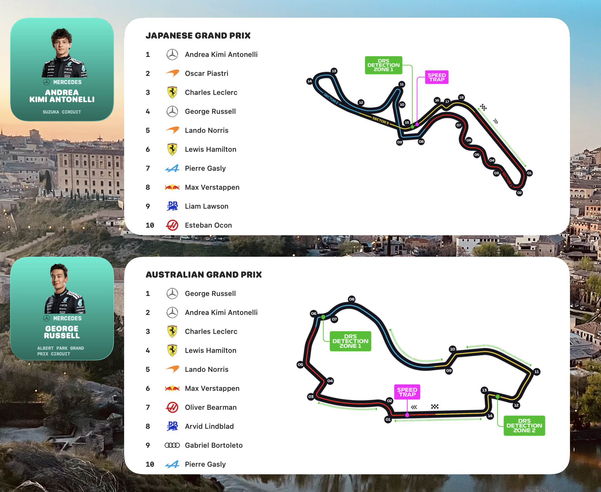
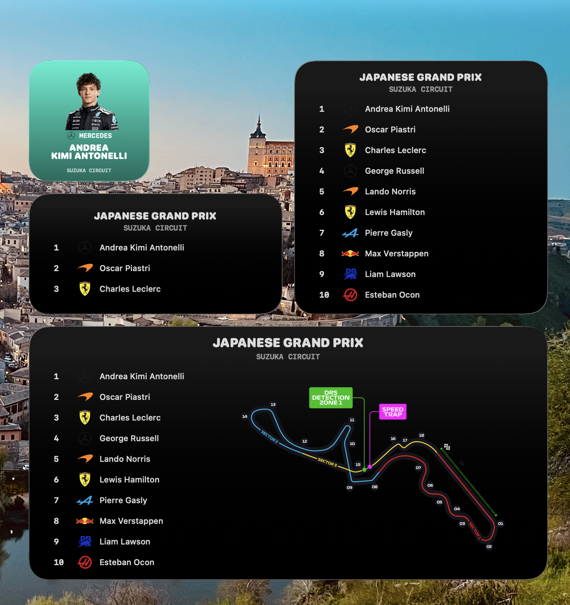

# Formula 1 Race Results Widget for macOS

A native macOS widget that displays the top 10 results from the most recent Formula 1 race.

## Features
- Fetches real-time data from the Jolpica-F1 API.
- Displays driver position, manufacturer icon, and driver name.
- Supports Small, Medium, Large, and Extra Large widget sizes.
- Built with SwiftUI and WidgetKit.

## Screenshots




## Prerequisites
- macOS 14.0 or later.
- Xcode 15.0 or later.
- [XcodeGen](https://github.com/yonaskolb/XcodeGen) (optional but recommended for building from this source).

## Building from Source

1.  **Install XcodeGen** (if not already installed):
    ```bash
    brew install xcodegen
    ```

2.  **Generate the Xcode Project**:
    In the root directory of this project, run:
    ```bash
    xcodegen generate
    ```

3.  **Open the Project**:
    ```bash
    open F1WidgetApp.xcodeproj
    ```

4.  **Run the Host App**:
    - Select the `F1WidgetApp` scheme.
    - Build and run (Cmd+R). This registers the widget with macOS.

5.  **Add the Widget**:
    - Open the Notification Center or Edit Widgets on your desktop.
    - Search for "F1 Race Results".
    - Choose your preferred size and add it.

## Data Sources
- **Race Data:** [Jolpica-F1 API](https://jolpi.ca/)
- **Manufacturer Logos:** From official Website.
- **Additional Info:** [subinium/awesome-f1](https://github.com/subinium/awesome-f1)

## License
This project is licensed under the GNU General Public License v3.0 - see the [LICENSE](LICENSE) file for details.
