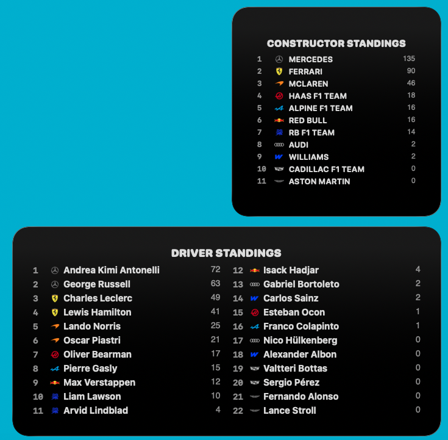

<p align="center"></p>

<h1 align="center">F1 Widget</h1>

A native macOS widget that displays real-time Formula 1 results and standings.


## Features
- Fetches real-time data from the Jolpica-F1 API.
- Displays driver position, constructor icon, and driver name.
- Supports Small, Medium, Large, and Extra Large widget sizes.
- Built with SwiftUI and WidgetKit.

## Available Widgets

### 🏁 Race Results
Displays the latest Grand Prix results including the winner's photo (small size), team logos, and the top 10/12 finishers.
- **Sizes:** Small, Medium, Large, Extra Large.
- **Customization:** Long-press the widget to select results from any race in the current season.

### 🏆 Standings
Keep track of the championship battle throughout the season.
- **Driver Standings:** Comprehensive list of all drivers, their positions, teams, and total points. (Extra Large only)
- **Constructor Standings:** Current team rankings with points and official logos. (Large only)

### 🗺️ Upcoming Race (New!)
The ultimate countdown to the next Grand Prix.
- **Sizes:** Extra Large.
- **Features:** Displays race date, location, a live day countdown, and a predominant high-quality track map.

## Screenshots





## Prerequisites
- macOS 14.0 or later.
- Xcode 15.0 or later.
- [XcodeGen](https://github.com/yonaskolb/XcodeGen) (optional but recommended for building from this source).

## Building from Source

1.  **Install XcodeGen** (if not already installed):
    ```bash
    brew install xcodegen
    ```

2.  **Generate the Xcode Project**:
    In the root directory of this project, run:
    ```bash
    xcodegen generate
    ```

3.  **Open the Project**:
    ```bash
    open F1WidgetApp.xcodeproj
    ```

4.  **Run the Host App**:
    - Select the `F1WidgetApp` scheme.
    - Build and run (Cmd+R). This registers the widget with macOS.

5.  **Add the Widget**:
    - Open the Notification Center or Edit Widgets on your desktop.
    - Search for "F1 Race Results".
    - Choose your preferred size and add it.

## Data Sources
- **Race Data:** [Jolpica-F1 API](https://jolpi.ca/)
- **Constructor Logos:** From official Website.
- **Additional Info:** [subinium/awesome-f1](https://github.com/subinium/awesome-f1)

## License
This project is licensed under the GNU General Public License v3.0 - see the [LICENSE](LICENSE) file for details.
